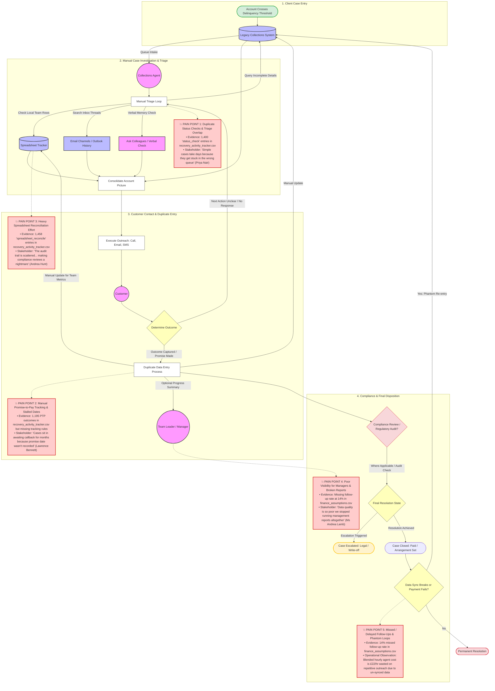

# Process Mapping Guide

Use this guide when you build the As-Is process map.

## 1. Key Process Actors & Systems 
### Operational Actors 
**Customer:** The account holder who has breached standard payment terms across Credit Card ($45.3\%$), Personal Loan ($39.2\%$), or Auto Finance ($15.5\%$) products. They interact passively via incoming phone calls, email replies, or letters.

**Collections Agent:** The core operator driving manual account reviews, customer outreach, and cross-system data synchronization.

**Team Leader / Manager:** The operational supervisor who monitors performance and tracking metrics primarily through localized spreadsheet files rather than core databases.

### Underlying Systems

**Legacy Collections System (legacy_db):** The primary system of record where delinquent accounts are initially flagged. It houses core financial details but contains significant information gaps.

**Spreadsheet Tracker (spreadsheet):** Disconnected local files manually updated by agents to manage day-to-day workflow tracking and team-level productivity reporting.

**Email & Manual Channels (email / phone):** Unlinked interaction layers used to manage communication histories, customer requests, and informal internal handoffs.

## 2. As-is workflow diagram

## 3. The Human Impact: How the Process Feels
### For a Customer: Confusing, Repetitive, and Interrogative
**The Experience:**
Customers are caught in an exhausting cycle of inconsistent communications. Because records don't automatically sync, a customer who already negotiated a payment arrangement via email might receive an aggressive automated SMS or a collection phone call the next day asking for the exact same information.
**The Feeling:**
It feels like the organization doesn't communicate internally. Customers report having to call back multiple times simply to remember or re-verify details because they are told different things by different agents, turning an already stressful debt situation into a frustrating administrative ordeal.

### For an Agent: Frustrating, Fragmented, and Bureaucratic
**The Experience:**
Agents spend a massive portion of their workdays acting as data-entry clerks rather than actual relationship managers. To handle a single customer, they have to jump between incomplete legacy systems, manual spreadsheets, and team-specific logs to cobble together basic account context. They must routinely manually record duplicate entries into spreadsheets just so their managers have visibility.
**The Feeling:**
It feels like fighting against the tools to get the job done. Straightforward cases that should take 10 minutes take 18 minutes instead because of the sheer volume of spreadsheet reconciliation and blind status checks. Agents feel forced to rely on unlogged personal "workarounds" rather than standard systems to keep up with performance goals.

### For a Team Leader or Manager: Blind, Reactive, and Stressed 
**The Experience:**
Managers are trapped operating with broken tracking instruments. Because data across the core systems is out-of-sync and unreliable, running standardized executive or operations reports is practically impossible. They are forced to micromanage via localized spreadsheet trackers to understand what their team achieved on a given day.
**The Feeling:**
It feels like navigating an operational minefield. With a $14\%$ missed follow-up rate and a compliance audit trail scattered across disparate emails and spreadsheets, managers are constantly worried about regulatory breaches, lost revenue, and cases quietly rotting in "awaiting callback" queues for months without their knowledge.

## 4. Strategic Automation Opportunities
The following automation initiatives target high-volume, highly repeatable, and rules-driven segments of the workflow.

### Automation Opportunities List
**Unified Digital Self-Service Portal:** Authenticates users, provides automated balance overviews, and allows customers to select standard payment configurations.

**Automated Multi-Channel Outreach Engine:** Programmatically triggers SMS and email notifications based on milestone dates, eliminating manual text/email dispatching.

**Centralized CRM System Integration:** Consolidates phone logs, local spreadsheets, email lines, and core account records into a unified agent dashboard.

**Automated Promise-to-Pay Ledger System:** Digitally tracks confirmed arrangement timelines, cross-references incoming bank statements, and flags payment defaults automatically without human intervention.

**Rules-Based Automated Ingestion and Triage Routing:** Auto-triages early-stage delinquencies via specific routing rules, preventing simple portfolios from bottlenecking manual queues.

**Automated Compliance Logging Engine:** Systematically writes non-editable timestamp logs for every status modification, eliminating manual reporting data entry.

### Traceability Matrix
| Opportunity ID | Proposed Automation Opportunity | Target Process Pain Point | Target Job-to-be-Done (JTBD) Framework |
| :--- | :--- | :--- | :--- |
| **OPP-01** | Unified Digital Self-Service Portal | **PP-02:** Manual PTP tracking errors & stranded files. | **Customer:** "When I default on a monthly statement, I need a private web portal to choose a repayment plan, so I can fix the issue without speaking to an agent." |
| **OPP-02** | Automated Multi-Channel Outreach Engine | **PP-05:** Missed or delayed customer touchpoints ($14\%$ rate). | **Operations:** "When an account enters early-stage default, we need to prompt them instantly via automated SMS/Email, so agents only touch complex accounts." |
| **OPP-03** | Centralized CRM System Integration | **PP-03:** Heavy manual reconciliation workloads ($1,458$ activities). | **Agent:** "When reviewing an account case, I need an integrated portal history, so I do not waste time cross-referencing multiple local team sheets." |
| **OPP-04** | Automated Promise-to-Pay Ledger System | **PP-02:** Cases languishing in callback status with unrecorded dates. | **Operations:** "When an arrangement window is set, we must track the bank balance automatically, so accounts never sit stale inside a queue." |
| **OPP-05** | Rules-Based Ingestion and Triage Routing | **PP-01:** Redundant status checks ($1,400$ entries) trapping low-tier portfolios. | **Manager:** "When collections portfolios spike, we need simple accounts auto-routed to digital paths, saving human resources for high-risk accounts." |
| **OPP-06** | Automated Compliance Logging Engine | **PP-04:** Complete lack of centralized management visibility & broken reports. | **Compliance:** "When a regulatory audit occurs, we need an automated system ledger of all histories, so we can verify compliance without file-hunting." |

## 5. Operational Guardrails: Agent-Led Boundaries
To safeguard the business against credit risk and regulatory compliance issues, specific strategic zones must remain strictly agent-led:

**Vulnerability & Vulnerable Customer Hardship Assessments:** As emphasized in the team reviews, “We cannot automate the decision about whether a customer is genuinely in hardship or just dodging contact”. Determining true vulnerability demands deep human empathy, investigative flexibility, and adherence to consumer protection rules that strict code logic cannot substitute.
**Collateralized Asset Configurations:** Accounts tied to asset-backed portfolios, such as Auto Finance ($15.5\%$ of current volume), cannot follow a completely automated recovery path. Asset valuation, repossession protocols, and voluntary surrender management involve complex logistics requiring human oversight and negotiation.
**Late-Stage Delinquency & Litigation Pathing:** High-severity accounts sitting in Late Delinquency ($15.9\%$) or labeled as legal_watch or specialist_review require delicate legal and financial management. Decisions relating to writing off debt balances or approving formal litigation should always require manual manager approval to minimize legal exposure.